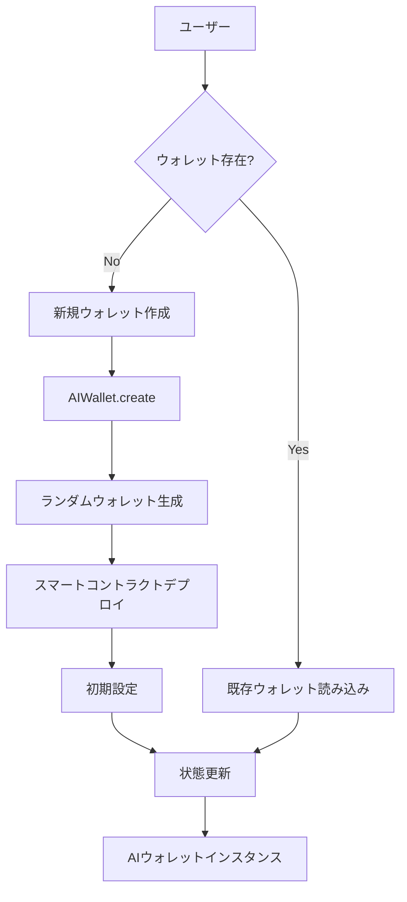
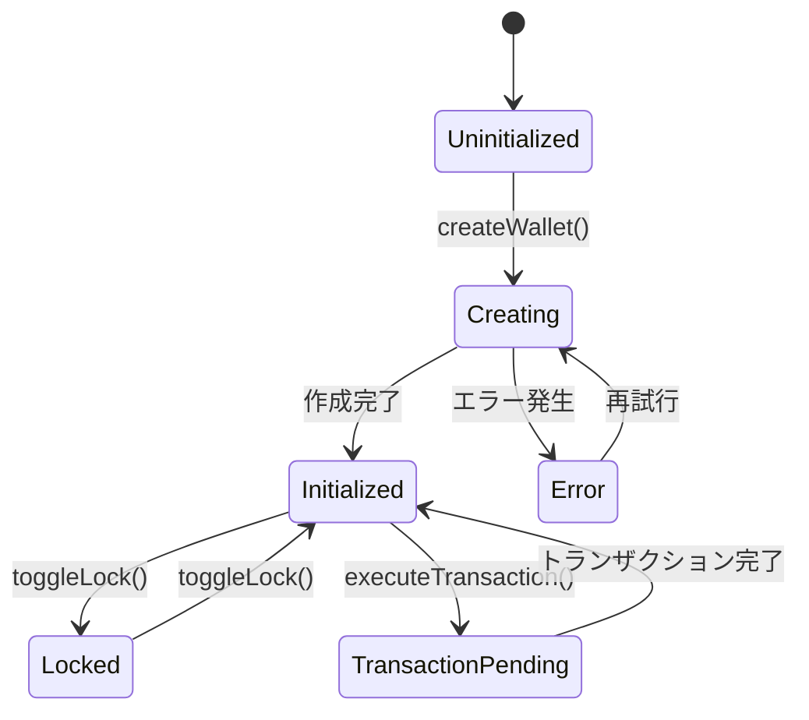
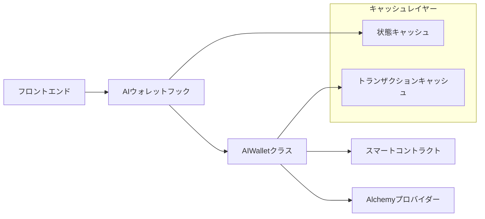
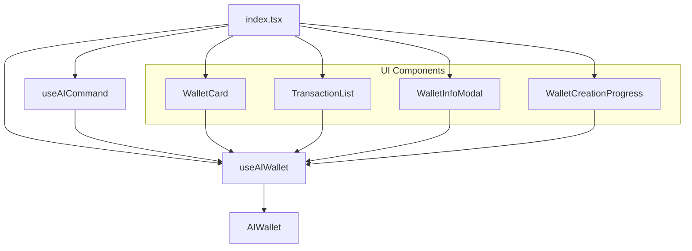
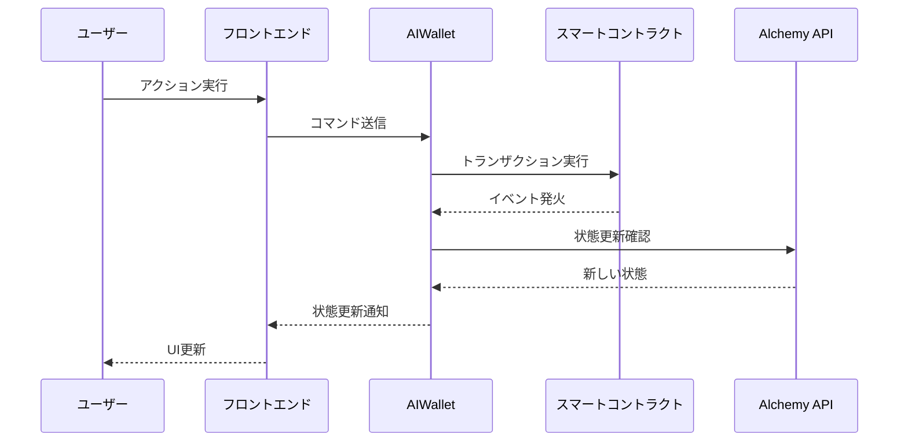
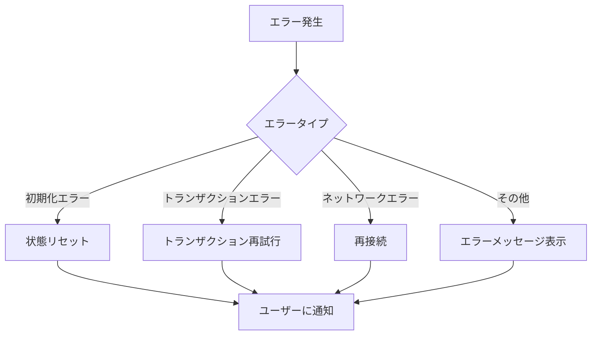
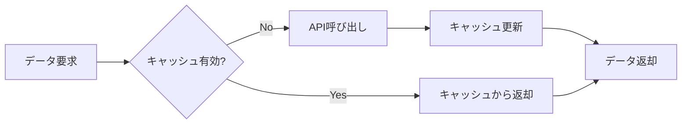

# システムフロー図

## ウォレット作成フロー

```mermaid
graph TD
    A[ユーザー] --> B{ウォレット存在?}
    B -->|No| C[新規ウォレット作成]
    B -->|Yes| D[既存ウォレット読み込み]
    
    C --> E[AIWallet.create]
    E --> F[ランダムウォレット生成]
    F --> G[スマートコントラクトデプロイ]
    G --> H[初期設定]
    H --> I[状態更新]
    
    D --> I
    I --> J[AIウォレットインスタンス]
```

## 状態管理フロー

```mermaid
stateDiagram-v2
    [*] --> Uninitialized
    Uninitialized --> Creating: createWallet()
    Creating --> Initialized: 作成完了
    Creating --> Error: エラー発生
    Error --> Creating: 再試行
    Initialized --> Locked: toggleLock()
    Locked --> Initialized: toggleLock()
    Initialized --> TransactionPending: executeTransaction()
    TransactionPending --> Initialized: トランザクション完了
```

## データフロー

```mermaid
graph LR
    A[フロントエンド] --> B[AIウォレットフック]
    B --> C[AIWalletクラス]
    C --> D[スマートコントラクト]
    C --> E[Alchemyプロバイダー]
    
    subgraph "キャッシュレイヤー"
        F[状態キャッシュ]
        G[トランザクションキャッシュ]
    end
    
    B --> F
    C --> G
```

## コンポーネント間の関係

```mermaid
graph TD
    A[index.tsx] --> B[useAIWallet]
    A --> C[useAICommand]
    B --> D[AIWallet]
    C --> B
    
    subgraph "UI Components"
        E[WalletCard]
        F[TransactionList]
        G[WalletInfoModal]
        H[WalletCreationProgress]
    end
    
    A --> E
    A --> F
    A --> G
    A --> H
    
    E --> B
    F --> B
    G --> B
    H --> B
```

## イベント処理フロー

```mermaid
sequenceDiagram
    participant U as ユーザー
    participant UI as フロントエンド
    participant W as AIWallet
    participant C as スマートコントラクト
    participant A as Alchemy API

    U->>UI: アクション実行
    UI->>W: コマンド送信
    W->>C: トランザクション実行
    C-->>W: イベント発火
    W->>A: 状態更新確認
    A-->>W: 新しい状態
    W-->>UI: 状態更新通知
    UI-->>U: UI更新
```

## エラーハンドリング

```mermaid
graph TD
    A[エラー発生] --> B{エラータイプ}
    B -->|初期化エラー| C[状態リセット]
    B -->|トランザクションエラー| D[トランザクション再試行]
    B -->|ネットワークエラー| E[再接続]
    B -->|その他| F[エラーメッセージ表示]
    
    C --> G[ユーザーに通知]
    D --> G
    E --> G
    F --> G
```

## キャッシュ戦略

```mermaid
graph LR
    A[データ要求] --> B{キャッシュ有効?}
    B -->|Yes| C[キャッシュから返却]
    B -->|No| D[API呼び出し]
    D --> E[キャッシュ更新]
    E --> F[データ返却]
    C --> F
```
